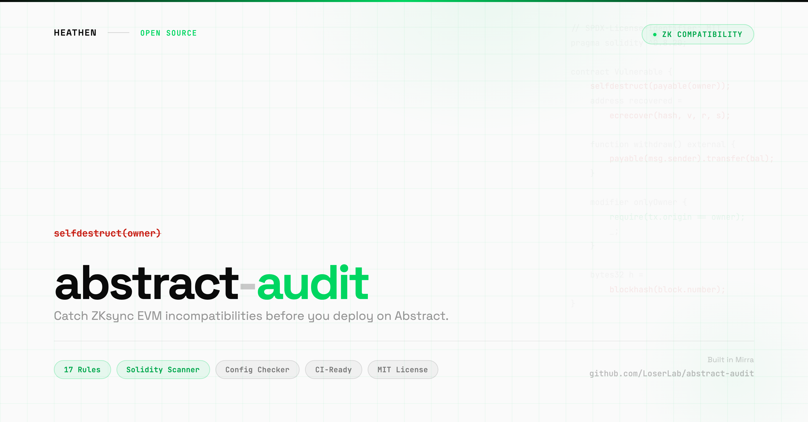

# abstract-audit

<p align="center">
  
</p>

Solidity contract and project scanner for Abstract (ZKsync L2). Catches EVM incompatibilities before deployment.

Zero network requests. Built-in rules. Instant results.

## Install

```bash
npx abstract-audit
```

Or install globally:

```bash
npm install -g abstract-audit
abstract-audit
```

## What it catches

Abstract runs on ZKsync Era, which has significant EVM differences. Standard Solidity contracts that work on Ethereum may fail to compile, deploy, or behave correctly on Abstract. `abstract-audit` scans your contracts and project config to catch these issues before you deploy.

Key differences from standard EVM:
- **Native account abstraction**: All accounts are smart contracts. EOA checks and gas stipend assumptions break.
- **Different opcodes**: selfdestruct, callcode, extcodecopy, and pc() are compile-time errors.
- **Different block properties**: block.coinbase returns the bootloader address. block.difficulty/prevrandao return a constant.
- **Different contract deployment**: Address derivation for CREATE/CREATE2 differs from Ethereum. Factory contracts need factoryDeps.
- **Different compiler**: Contracts must be compiled with zksolc, not standard solc.

### Full Registry

| Severity | Pattern | Issue | Fix |
|---|---|---|---|
| CRITICAL | `selfdestruct()` | Compile-time error on ZKsync | Remove; use paused/disabled pattern |
| CRITICAL | `callcode()` | Compile-time error on ZKsync | Use delegatecall |
| CRITICAL | `extcodecopy()` | Compile-time error on ZKsync | Use extcodehash for code verification |
| CRITICAL | `pc()` | Compile-time error on ZKsync | Remove; no equivalent exists |
| HIGH | `.transfer()` | 2300 gas stipend insufficient (all accounts are contracts) | Use `.call{value: amount}("")` |
| HIGH | `.send()` | 2300 gas stipend insufficient (all accounts are contracts) | Use `.call{value: amount}("")` |
| HIGH | `ecrecover()` | Does not support smart contract wallets | Use EIP-1271 `isValidSignature` |
| HIGH | `block.coinbase` | Returns 0x8001 bootloader address | Do not rely on for validator ID |
| HIGH | `block.difficulty` | Returns constant 2500000000000000 | Use VRF oracle for randomness |
| HIGH | `prevrandao` | Returns constant 2500000000000000 | Use VRF oracle for randomness |
| MODERATE | `gasleft()` | Does not account for pubdata costs | Account for L1 data availability fees |
| MODERATE | `extcodesize()` | Cannot distinguish EOAs from contracts | Remove EOA checks |
| MODERATE | `address(this).code.length` | Unreliable for constructor detection | Use Initializable pattern |
| MODERATE | `tx.origin == msg.sender` | Cannot detect EOAs (all accounts are contracts) | Remove EOA checks |
| MODERATE | `CREATE`/`CREATE2` in assembly | Address derivation differs from Ethereum | Use ZKsync system deployer |
| HIGH | Missing `@matterlabs/hardhat-zksync` | Hardhat cannot compile for ZKsync | Install the plugin |
| MODERATE | Deprecated `@matterlabs/hardhat-zksync-*` | Individual packages deprecated | Use unified `@matterlabs/hardhat-zksync` |

## Usage

```bash
# Scan current directory
npx abstract-audit

# Scan specific project
npx abstract-audit ./my-project

# JSON output (for CI/CD)
npx abstract-audit --json

# Only show critical and high severity
npx abstract-audit --severity high
```

## Example Output

```
abstract-audit v0.1.0

Scanning project... Found 5 files (3 .sol, 2 config)

  CRITICAL  contracts/Vault.sol:42
            selfdestruct is not supported on ZKsync
            Fix: Remove selfdestruct. Use a paused/disabled pattern with access control instead.

  HIGH      contracts/Vault.sol:28
            .transfer() will fail on Abstract
            Fix: Use .call{value: amount}("") instead of .transfer().

  HIGH      contracts/Auth.sol:15
            ecrecover does not account for smart contract wallets
            Fix: Use EIP-1271 (isValidSignature) to support both EOA and smart contract wallet signatures.

  MODERATE  contracts/Utils.sol:8
            tx.origin == msg.sender cannot detect EOAs on Abstract
            Fix: Remove EOA checks. Design contracts to work with both EOAs and smart contract wallets.

4 issues found (1 critical, 2 high, 1 moderate)
```

## Exit Codes

| Code | Meaning |
|---|---|
| 0 | No issues found |
| 1 | High or moderate issues found |
| 2 | Critical issues found |

Use exit codes in CI pipelines to block deploys with critical incompatibilities.

## Part of the Abstract Developer Toolkit

| Tool | What it does |
|------|-------------|
| **abstract-audit** (this tool) | Catch EVM incompatibilities in your Solidity contracts |
| [x402-fetch](https://github.com/LoserLab/x402-fetch) | HTTP client for x402 paid API endpoints on Abstract |
| [abstract-gas](https://github.com/LoserLab/abstract-gas) | Estimate gas costs on Abstract vs Ethereum |

**Recommended workflow:** `abstract-audit` (check contracts) -> `abstract-gas` (estimate costs) -> deploy on Abstract.

## Author

Created by [**Heathen**](https://x.com/heathenft)

Built in [Mirra](https://mirra.app)

## License

MIT License

Copyright (c) 2026 Heathen